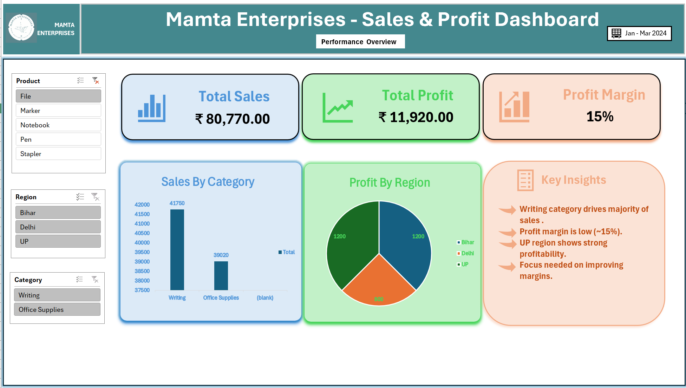

#  Sales Dashboard (Excel)

This project is an interactive Sales Dashboard built using Excel.

##  Dashboard Preview

##  File

- sales_dashboard.xlsx → Contains both dataset and dashboard

##  Key Insights

- Total Sales Performance
- Monthly Sales Trend
- Region-wise Sales Analysis
- Top Products by Revenue
- Profit Analysis

##  Tools Used

- Microsoft Excel
- Pivot Tables
- Charts
- Slicers

##  Description

The dataset and dashboard are combined in a single Excel file.  
Users can interact with filters and slicers to analyze sales performance dynamically.
